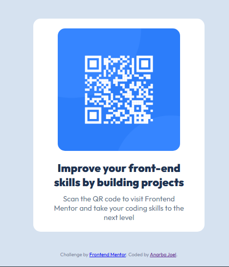

# Frontend Mentor - QR code component solution

## Table of contents

- [Overview](#overview)
  - [Screenshot](#screenshot)
  - [Links](#links)
- [My process](#my-process)
  - [Built with](#built-with)
  - [What I learned](#what-i-learned)
  - [Continued development](#continued-development)
  - [Useful resources](#useful-resources)
- [Author](#author)

## Overview

### Screenshot

### Links

- Solution URL: [Frontendmentor]( https://www.frontendmentor.io/solutions/responsive-qr-code-component-using-flexbox-and-mobile-first-design-ymlwPXDT8o
)
- Live Site URL: [github pages](https://joelanarba.github.io/qr-code-component/)

## My process

### Built with

- Semantic HTML5 markup
- CSS custom properties
- Flexbox
- Mobile-first workflow
- Google Fonts (Outfit)

### What I learned

Responsiveness and Flexbox: I gained more hands-on experience in creating responsive layouts. Using Flexbox allowed me to center elements and create a flexible, mobile-first design. I also learned how to handle different screen sizes effectively by adjusting widths and applying max-width for images.

Styling a simple design: Although the challenge was simple, I practiced creating a clean, minimalist design that doesn't overwhelm the user. I learned how to balance text, images, and spacing to create an aesthetically pleasing layout.

Working with images: I worked with images (QR code) and figured out how to make them responsive while maintaining the design's integrity across different screen sizes.

Mobile-first workflow: I practiced the concept of starting with a mobile layout and scaling up. This was a good reminder of the importance of prioritizing mobile design in today’s web development practices.

### Continued development

Improving accessibility: In the future, I plan to improve the accessibility of this component, like adding more alt text and considering color contrast for users with visual impairments.

Advanced CSS techniques: I want to explore using more advanced CSS techniques, such as CSS Grid, for future projects to have more control over layouts.

JavaScript functionality: If I expand this project, I could integrate JavaScript to allow users to generate their own QR codes or interact with the component in more dynamic ways.

### Useful resources

- [Google Fonts](https://fonts.google.com/) - I used Google Fonts to select the "Outfit" font, which gave the component a modern and clean look.
- [Frontend Mentor](https://www.frontendmentor.io/home) - This platform provided the challenge and is a great resource for improving coding skills through real-world projects.

## Author

- Website - [Amuni Anarba Joel](https://github.com/joelanarba)
- Frontend Mentor - [@joelanarba](https://www.frontendmentor.io/profile/joelanarba)
- Twitter - [@joelanarba](https://www.twitter.com/joelanarba)
- LinkedIn - [@joelanarba](https://www.linkedin.com/joelanarba)
